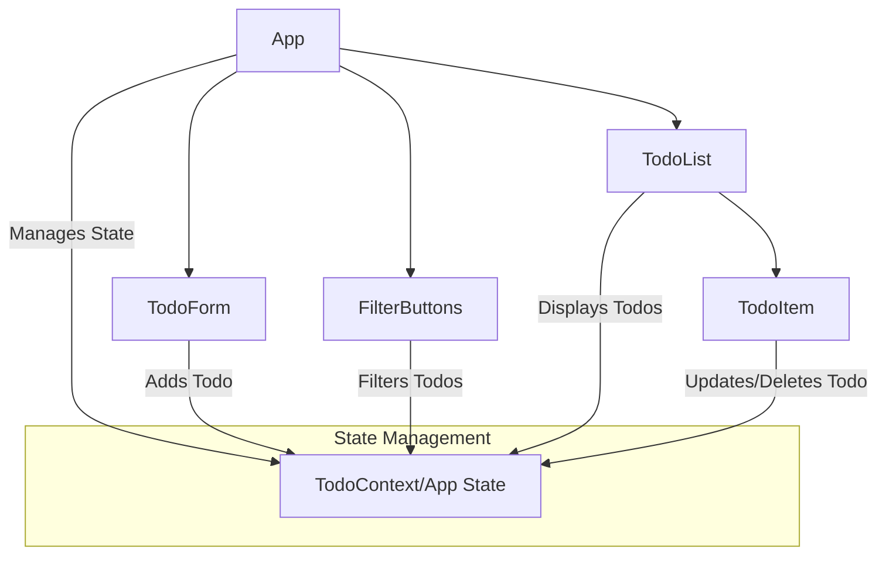

# React 新手项目：待办事项列表 (Todo List) 应用架构设计

## 1. 项目概述

这个项目旨在帮助 React 新手从零开始学习 React 的核心概念，通过构建一个简单的待办事项列表应用来实践组件化、状态管理和数据流。

**功能需求：**
*   显示待办事项列表。
*   添加新的待办事项。
*   标记待办事项为已完成/未完成。
*   删除待办事项。
*   过滤待办事项（全部、已完成、未完成）。

## 2. 技术栈

*   **前端框架：** React (使用 Create React App 或 Vite 初始化项目)
*   **样式：** CSS Modules 或 Tailwind CSS (可选，为了简化，初期可直接使用普通 CSS)
*   **状态管理：** React 内置的 `useState` 和 `useContext` (对于简单应用足够)
*   **构建工具：** Vite (推荐，比 Create React App 更快更轻量)

## 3. 项目结构

一个推荐的简单项目结构如下：

```
react-todo-app/
├── public/
│   └── index.html
├── src/
│   ├── assets/           # 静态资源，如图片、图标
│   ├── components/       # 可复用的小组件
│   │   ├── TodoItem.jsx
│   │   ├── TodoList.jsx
│   │   ├── TodoForm.jsx
│   │   └── FilterButtons.jsx
│   ├── contexts/         # 全局状态管理 Context (如果使用 useContext)
│   │   └── TodoContext.jsx
│   ├── hooks/            # 自定义 Hooks (如果需要)
│   │   └── useTodos.js
│   ├── App.jsx           # 主应用组件
│   ├── main.jsx          # 应用入口文件 (Vite)
│   ├── index.css         # 全局样式
│   └── utils/            # 工具函数
│       └── localStorage.js
├── .gitignore
├── package.json
├── vite.config.js        # Vite 配置文件
└── README.md
```

## 4. 核心组件设计

我们将应用拆分为以下核心组件：



*   **`App.jsx`**:
    *   应用的根组件。
    *   管理所有待办事项的**状态** (例如，一个待办事项数组 `todos`)。
    *   管理当前的**过滤状态** (例如，`filter`，可以是 'all', 'completed', 'active')。
    *   负责渲染 `TodoForm`、`FilterButtons` 和 `TodoList`。
    *   将状态和操作函数（如 `addTodo`, `toggleTodo`, `deleteTodo`, `setFilter`）通过 props 传递给子组件。

*   **`TodoForm.jsx`**:
    *   包含一个输入框和一个添加按钮。
    *   负责收集用户输入的待办事项文本。
    *   通过 `props` 接收 `addTodo` 函数，并在用户提交时调用它。

*   **`FilterButtons.jsx`**:
    *   包含“全部”、“已完成”、“未完成”等过滤按钮。
    *   通过 `props` 接收 `setFilter` 函数，并在用户点击时调用它来改变 `App` 组件中的过滤状态。

*   **`TodoList.jsx`**:
    *   接收过滤后的待办事项数组 `filteredTodos` 作为 `props`。
    *   遍历 `filteredTodos` 数组，为每个待办事项渲染一个 `TodoItem` 组件。
    *   将 `toggleTodo` 和 `deleteTodo` 函数传递给每个 `TodoItem`。

*   **`TodoItem.jsx`**:
    *   接收单个待办事项对象作为 `props`。
    *   显示待办事项的文本和完成状态。
    *   包含一个复选框（或按钮）用于切换完成状态。
    *   包含一个删除按钮。
    *   通过 `props` 接收 `toggleTodo` 和 `deleteTodo` 函数，并在用户交互时调用它们。

## 5. 数据流 (单向数据流)

React 遵循单向数据流原则，数据从父组件流向子组件。

1.  **状态定义：** `App.jsx` 组件中定义 `todos` 数组和 `filter` 状态。
2.  **数据传递：**
    *   `todos` 和 `filter` 状态作为 `props` 传递给 `TodoList` 和 `FilterButtons`。
    *   `TodoList` 进一步将单个 `todo` 对象传递给 `TodoItem`。
3.  **事件处理：**
    *   `TodoForm` 调用 `App` 传递的 `addTodo` 函数来更新 `todos` 状态。
    *   `FilterButtons` 调用 `App` 传递的 `setFilter` 函数来更新 `filter` 状态。
    *   `TodoItem` 调用 `App` 传递的 `toggleTodo` 和 `deleteTodo` 函数来更新 `todos` 状态。
4.  **状态更新：** 当 `App` 组件中的状态更新时，React 会重新渲染相关的组件，从而反映最新的数据。

## 6. 开发步骤建议

1.  **环境搭建：** 使用 Vite 创建一个新的 React 项目。
    ```bash
    npm create vite@latest my-todo-app -- --template react
    cd my-todo-app
    npm install
    npm run dev
    ```
2.  **创建 `App.jsx`：** 在 `App.jsx` 中初始化 `todos` 状态（一个空数组），并渲染一个简单的标题。
3.  **创建 `TodoForm.jsx`：** 实现输入框和添加按钮，并将其集成到 `App.jsx` 中。在 `App.jsx` 中实现 `addTodo` 函数并传递给 `TodoForm`。
4.  **创建 `TodoList.jsx` 和 `TodoItem.jsx`：**
    *   在 `App.jsx` 中添加一些模拟的待办事项数据到 `todos` 数组。
    *   实现 `TodoList` 遍历 `todos` 并渲染 `TodoItem`。
    *   实现 `TodoItem` 显示待办事项文本。
5.  **实现完成/删除功能：**
    *   在 `App.jsx` 中实现 `toggleTodo` 和 `deleteTodo` 函数。
    *   将这些函数传递给 `TodoList`，再传递给 `TodoItem`。
    *   在 `TodoItem` 中添加复选框和删除按钮，并绑定相应的事件。
6.  **实现过滤功能：**
    *   在 `App.jsx` 中添加 `filter` 状态和 `setFilter` 函数。
    *   创建 `FilterButtons.jsx` 并将其集成到 `App.jsx` 中，传递 `setFilter`。
    *   在 `App.jsx` 中根据 `filter` 状态过滤 `todos`，并将过滤后的结果传递给 `TodoList`。
7.  **持久化数据 (可选)：** 使用 `localStorage` 将 `todos` 数据存储在浏览器中，以便刷新页面后数据不丢失。可以在 `App.jsx` 中使用 `useEffect` 钩子来实现。
8.  **样式美化：** 添加 CSS 样式，使应用看起来更美观。

通过以上步骤，你将逐步构建一个完整的 React 待办事项列表应用，并掌握 React 的核心概念。